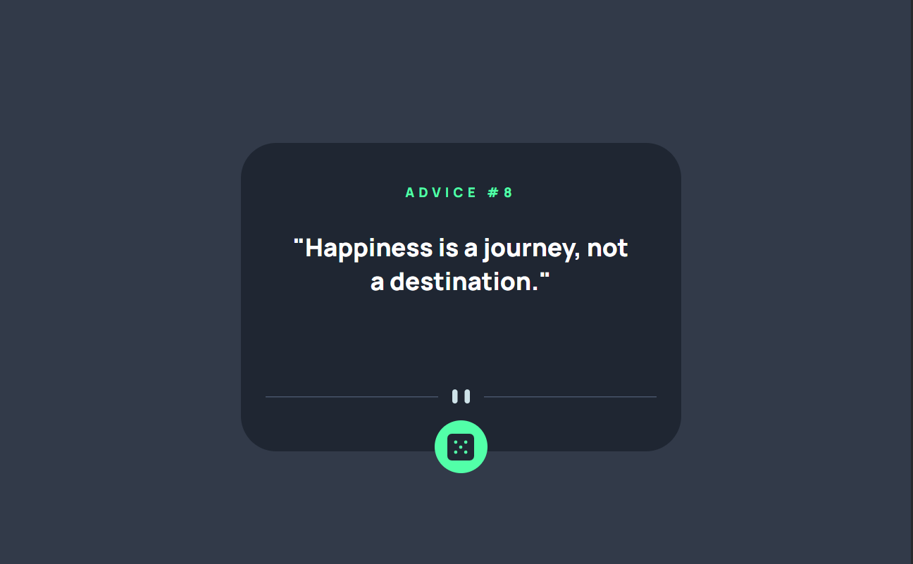

## Table of contents

- [Overview](#overview)
  - [The challenge](#the-challenge)
  - [Screenshot](#screenshot)
  - [Links](#links)
- [My process](#my-process)
  - [Built with](#built-with)
  - [What I learned](#what-i-learned)
- [Author](#author)

## Overview

### The challenge

Users should be able to:

- View the optimal layout for the app depending on their device's screen size
- See hover states for all interactive elements on the page
- Generate a new piece of advice by clicking the dice icon

### Screenshot

### Links

- Solution URL: [GitHub](https://github.com/gabadadzeluca/advice-generator-app)
- Live Site URL: [Live URL](https://gabadadzeluca.github.io/advice-generator-app/)

## My process

### Built with

- Semantic HTML5 markup
- CSS custom properties
- Flexbox
- Mobile-first workflow
- JavaScript

### What I learned

I've used a dynamic API for the first time and I also improved on my responsive skills, I worked out a problem of overflow I had in my previous project.

## Author

- LinkedIn - [Luca Gabadadze](https://www.linkedin.com/in/luca-gabadadze-6068b324a/)
